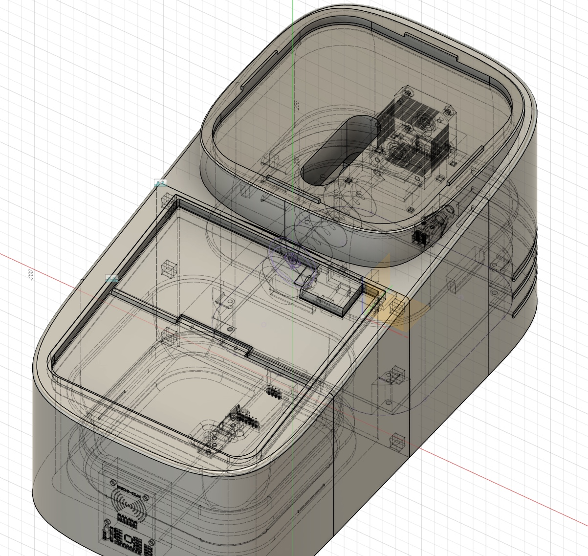

## 1. 프로젝트 개요

### 프로젝트명

**ILLO (일로)**

### 주제

**다묘·다견 가정을 위한 개체 구별 자동 급식기**

ILLO는 여러 마리의 반려동물을 키우는 가정에서 각 개체의 식사량을 정확히 관리하기 위한 자동 급식기입니다. RFID 태그를 이용해 반려동물을 개별 인식하고, 설정된 양만큼 사료를 배식하며, 식사 후 남은 잔량까지 측정하여 앱에서 확인할 수 있도록 설계되었습니다.

---

## 2. 기획 배경 및 문제 정의

국내 반려동물 가구 중 다견·다묘 가정은 약 **23.9%**를 차지합니다. 여러 마리의 반려동물을 함께 키우는 가정에서는 밥그릇을 따로 두더라도 실제로 각 개체가 자기 몫을 먹고 있는지 확인하기 어렵습니다.

### 문제 상황

다견·다묘 가정에서는 다음과 같은 문제가 자주 발생합니다.

* 성격이 온순한 반려동물은 다른 개체에게 밥을 빼앗길 수 있음
* 비만이 걱정되는 반려동물은 사람이 직접 지켜보지 않으면 식사량 조절이 어려움
* 보호자가 외출 중일 때 개체별 식사 여부와 실제 섭취량을 확인하기 어려움
* 단순 자동 급식기는 “얼마나 배급했는지”는 알 수 있지만, “실제로 얼마나 먹었는지”는 알기 어려움

따라서 ILLO는 단순 배식 기능을 넘어서, **개체 인식**, **정량 배식**, **잔량 측정**, **식습관 데이터 기록**을 통합한 다견·다묘 가정용 스마트 급식기를 목표로 기획되었습니다.

---

## 3. ILLO 주요 기능 및 솔루션

### 3.1 개체별 맞춤 배식

반려동물의 목걸이에 부착된 **RFID 태그**를 통해 개체를 식별합니다. 등록된 반려동물이 급식기 앞에 접근했을 때만 배식이 진행되도록 하여, 다른 개체가 대신 먹는 상황을 줄일 수 있습니다.

### 3.2 정확한 식사 관리

로드셀 기반 무게 측정 시스템을 사용하여 설정된 양만큼 사료를 배식합니다. 또한 식사 후 남은 잔량을 측정하여 실제 섭취량을 계산할 수 있습니다.

### 3.3 편리한 스케줄 관리

전용 애플리케이션을 통해 보호자가 개체별 급식 스케줄과 급식량을 설정, 변경, 관리할 수 있습니다.

### 3.4 식습관 데이터 추적

앱에서 개체별 식사량과 잔량 데이터를 확인할 수 있으며, 일정 기간의 데이터를 그래프로 시각화하여 반려동물의 식습관 변화를 파악할 수 있습니다.

### 3.5 다견·다묘 가정을 위한 대용량 사료 저장통

ILLO는 **4.5L 사료 저장통**을 적용하여 여러 마리의 반려동물을 키우는 가정에서도 안정적으로 사용할 수 있도록 설계되었습니다.

### 3.6 하드웨어 및 소프트웨어 안정성

제품 안정성을 위해 다음 요소를 고려했습니다.

* PCB 설계를 통한 회로 안정화
* 여러 기능의 동시 처리를 고려한 소프트웨어 구조
* 무게 측정, RFID 인식, 모터 제어의 동시 처리 설계
* 배식 중 사료 걸림을 감지하고 자동으로 해결하는 모터 제어 로직
* 전원 라인 분리 및 캐패시터 적용을 통한 노이즈 관리

### 3.7 반려동물 적응 훈련 지원

수동 개폐 버튼을 통해 보호자가 직접 문을 열고 간식을 주는 방식으로 급식기에 대한 긍정적인 경험을 제공할 수 있습니다. 이를 통해 반려동물이 급식기에 자연스럽게 적응하도록 돕습니다.

---

## 4. ILLO만의 차별점

### 4.1 실시간 잔량 모니터링

기존 자동 급식기가 주로 “배급한 양”에 초점을 맞춘다면, ILLO는 식사 후 남은 사료의 양까지 측정하여 **실제로 먹은 양**과 **남긴 양**을 확인할 수 있습니다.

### 4.2 스마트한 다음 배급

이번 배식에서 사료를 남긴 경우, 다음 배급 시 남긴 양을 고려하여 배급량을 조절합니다. 이를 통해 과식을 방지하고 사료 낭비를 줄일 수 있습니다.

### 4.3 적응 훈련 기능

수동 개폐 버튼을 구현하여 보호자가 직접 급식기를 열고 간식을 제공할 수 있습니다. 이는 반려동물이 급식기를 낯선 장치가 아니라 긍정적인 보상을 주는 대상으로 인식하도록 돕는 기능입니다.

---

## 5. 프로젝트 팀 구성

| 분야                | 담당자           |
| ----------------- | ------------- |
| Hardware          | 김기범, 안현서, 허재원 |
| Firmware          | 김기범, 안현서      |
| Design & Modeling | 하채연, 허재원      |
| Networking        | 박상현           |
| Application       | 고시온, 박상현      |

---

## 6. Hardware

ILLO의 하드웨어는 개체 인식, 문 개폐, 사료 배식, 무게 측정, 전원 안정화 기능을 중심으로 구성되었습니다.

### 6.1 개체 인식 기능

#### RFID

* 사용 부품: **RC522 RFID Module**
* 목적: 반려동물 목걸이에 부착된 RFID 태그를 통해 개체 식별
* 예상 인식 거리: 5~10cm
* 실제 테스트 결과: 약 2~3cm 수준으로 예상보다 짧은 인식 거리 확인

RC522는 초기 프로토타입 제작에는 적합했지만, 실제 제품 수준에서는 인식 거리가 짧다는 한계가 있었습니다. 추후 개선 방향으로는 **134.2kHz RFID Reader**와 **외부 안테나**를 적용하여 반려동물 접근 인식 범위를 확장할 수 있습니다.

#### 문 개폐용 서보모터

* 사용 부품: **SG90 Servo Motor**
* 목적: RFID 인식 후 해당 개체에게만 급식 공간 개방
* 요구 조건: 급식기 도어의 무게를 안정적으로 열고 닫을 수 있는 토크 확보

---

### 6.2 배식 기능

#### 스텝모터 기반 사료 배출

* 사용 부품:

  * **NEMA 17HS4401S Stepper Motor**
  * **TMC2209 Stepper Motor Driver**
* 목적:

  * 일정한 회전량을 기반으로 사료를 정량 배출
  * 사료 걸림 발생 시 역회전과 정회전을 통해 자동 복구

사료 배출부는 스텝모터를 사용하여 정밀한 제어가 가능하도록 설계했습니다. 또한 일반 DC 모터와 달리 회전량 제어가 용이하여 정량 배식 구현에 적합합니다.

---

### 6.3 무게 측정 기능

#### 로드셀 및 HX711

* 사용 부품:

  * **Load Cell**
  * **HX711 Amplifier Module**
* 목적:

  * 배식 중 실시간 무게 측정
  * 목표 배식량 도달 여부 판단
  * 식사 후 잔량 측정

로드셀은 사료의 실제 무게를 측정하는 핵심 부품입니다. 이를 통해 단순히 모터 회전 시간만으로 배식량을 추정하는 것이 아니라, 실제 배출된 사료 무게를 기준으로 더 정확한 배식이 가능하도록 했습니다.

---

### 6.4 MCU 선정

#### ESP32 DevKit V4

* 사용 부품: **ESP32 DevKit V4**
* 선정 이유:

  * Wi-Fi 통신 지원
  * MQTT 기반 네트워크 통신 구현 가능
  * Arduino Framework 기반 개발 용이
  * RFID, 로드셀, 모터 드라이버 등 다양한 주변장치 제어 가능
  * 비교적 낮은 가격과 높은 확장성

---

### 6.5 전원부 설계

ILLO는 여러 부품이 서로 다른 전압을 요구하기 때문에 전원 분배 구조를 다음과 같이 설계했습니다.

* 외부 입력 전원: **12V 5A 어댑터**
* 전압 분기:

  * 12V → 모터 구동부
  * 12V → 5V Buck Converter
  * 5V → 3.3V Regulator
* 적용 목적:

  * 각 부품 사양에 맞는 안정적인 전압 공급
  * 모터 구동부와 센서부의 전원 간섭 최소화

---

### 6.6 노이즈 관리

로드셀과 RFID 모듈은 전원 노이즈에 민감하기 때문에 전원 라인 분리와 캐패시터를 적극적으로 적용했습니다.

* HX711, RC522 전원 라인 분리
* Regulator를 통한 센서부 전원 안정화
* 벌크 캐패시터: **10µF**
* 바이패스 캐패시터: **100nF**
* 12V 라인에는 전류량을 고려하여 **20AWG 이상 점퍼 케이블** 사용

---

### 6.7 회로 테스트 및 PCB 설계

프로토타입 단계에서는 브레드보드와 점퍼 케이블을 활용하여 각 부품의 동작을 개별적으로 검증했습니다. 이후 회로 안정성과 배선 정리를 위해 PCB 설계를 진행했습니다.

#### 회로 테스트 이미지


---

## 7. Firmware

ILLO의 펌웨어는 ESP32를 기반으로 하며, Arduino Framework와 C++을 사용하여 개발했습니다.

### 7.1 개발 환경

* MCU: **ESP32 DevKit V4**
* Framework: **Arduino Framework**
* Language: **C++**
* 주요 제어 대상:

  * RFID RC522
  * Servo Motor
  * Stepper Motor
  * TMC2209 Driver
  * Load Cell / HX711
  * MQTT 통신 모듈

---

### 7.2 소프트웨어 아키텍처

ILLO의 펌웨어는 시스템 안정성과 유지보수성을 높이기 위해 **이벤트 기반 유한 상태 머신**과 **협력적 멀티태스킹** 구조를 적용했습니다.

---

### 7.3 이벤트 기반 유한 상태 머신

시스템의 상태를 명확하게 구분하기 위해 ENUM 기반 FSM 구조를 사용했습니다.

예시 상태는 다음과 같습니다.

* 대기 상태
* RFID 인식 상태
* 문 개방 상태
* 사료 배급 상태
* 식사 대기 상태
* 잔량 측정 상태
* 오류 상태

이 구조에서는 스케줄 도달, RFID 인식, 버튼 입력, 목표 무게 도달, 사료 걸림 감지와 같은 이벤트가 발생했을 때만 상태가 전이됩니다.

#### 장점

* 현재 시스템 상태를 명확히 파악 가능
* 예외 상황 처리 용이
* 기능 추가 시 유지보수성 향상
* 무분별한 동작 중복 방지

---

### 7.4 협력적 멀티태스킹

ILLO는 배식 중에도 스케줄 변경, MQTT 명령 수신, 센서 측정 등을 처리해야 합니다. 이를 위해 delay 기반의 blocking 코드를 최소화하고, 각 기능을 짧게 실행되는 task 함수로 분리했습니다.

#### 예시 태스크

* RFID 인식 태스크
* 로드셀 측정 태스크
* 모터 제어 태스크
* MQTT 수신 태스크
* 스케줄 확인 태스크
* 상태 전이 처리 태스크

각 태스크는 메인 루프에서 반복 호출되며, 필요한 경우에만 동작합니다.

#### 장점

* 특정 기능이 CPU를 독점하는 문제 방지
* 배식 중에도 앱 명령 수신 가능
* 시스템 반응성 향상
* 기능별 코드 분리로 디버깅 용이

---

### 7.5 사료 걸림 감지 및 해결 로직

사료 배식 중 로드셀 값의 변화가 일정 시간 동안 감지되지 않으면 사료가 걸린 것으로 판단합니다.

#### 처리 방식

1. 목표 배식량까지 스텝모터 정회전
2. 일정 시간 동안 무게 변화가 없으면 걸림 상태로 판단
3. 스텝모터 역회전
4. 다시 정회전
5. 무게 변화가 복구되면 배식 재개
6. 반복 실패 시 오류 상태로 전환

이를 통해 사료가 스크류 내부에서 막히는 상황을 자동으로 완화할 수 있습니다.

---

## 8. Design & Modeling

ILLO는 반려동물의 건강과 직접적으로 연결되는 제품이기 때문에 디자인 방향을 **신뢰성**과 **안정감**에 두었습니다.

---

### 8.1 배식 방식: Auger Screw

ILLO는 사료 배출 방식으로 **Auger Screw** 구조를 사용했습니다.

#### 개요

스텝모터와 연결된 나선형 스크류가 회전하면서 사료를 앞으로 밀어내는 방식입니다. 이 구조는 회전량 기반 제어가 가능하여 정량 배식에 적합합니다.

#### 특징

* 스텝모터 회전량 기반 배식량 제어 가능
* 8mm~15mm 크기의 소형·중형견 사료 배출 가능
* 사료 걸림 발생 시 역회전 제어 가능
* 구조가 비교적 단순하여 유지보수 용이

---

### 8.2 사료 걸림 최소화 구조

오거 스크류 방식은 사료 크기와 형태에 따라 걸림이 발생할 수 있습니다. 이를 줄이기 위해 배출부 내부 형상과 스크류 구조를 조정하고, 펌웨어 차원에서 걸림 해결 로직을 함께 적용했습니다.

* 무게 변화 기반 걸림 판단
* 스텝모터 역회전 후 정회전
* 사료 배출구 각도 및 내부 공간 설계 고려

---

### 8.3 디자인 키워드

#### 신뢰성

자동 급식기는 보호자가 직접 지켜보지 않는 상황에서도 반려동물의 식사를 책임지는 제품입니다. 따라서 외형에서도 쉽게 쓰러지거나 불안정해 보이지 않도록 단단한 인상을 주는 디자인을 목표로 했습니다.

#### 안정감

반려동물이 사용하는 제품이므로, 지나치게 날카롭거나 위협적인 형태보다는 부드러운 곡선을 활용하여 안정적인 인상을 주도록 설계했습니다.

---

### 8.4 컬러

#### White

흰색은 청결함과 위생적인 이미지를 전달합니다. 사료와 직접적으로 관련된 제품인 만큼 깨끗한 인상을 주기 위해 메인 컬러로 사용했습니다.

#### Dark Navy

다크 네이비는 무게감과 신뢰감을 주는 색상입니다. 제품의 하단부 또는 포인트 컬러로 적용하여 안정적인 느낌을 강조했습니다.

---

### 8.5 사이즈 설계

#### 사료통 용량: 4.5L

중형견의 하루 섭취량을 약 310g으로 가정했을 때, 4.5L 용량은 약 15일치 사료를 보관할 수 있는 수준입니다. 이는 위생적으로 권장되는 사료 교체 주기인 2~3주와도 적절히 맞습니다.

#### 밥그릇 높이: 12cm

밥그릇 높이는 약 12cm로 설계했습니다. 이는 초소형견을 제외한 대부분의 소형~중형견에게 적합한 높이이며, 필요 시 받침대를 추가하여 개체별 맞춤 조절이 가능하도록 확장할 수 있습니다.

---

### 8.6 형태 설계

#### 상단 시점

위에서 보았을 때는 직선을 최소화하고 부드러운 곡선을 사용하여 안정감과 친근한 인상을 주도록 했습니다.

#### 측면 시점

측면에서는 일부 사선 형태를 적용하여 제품의 신뢰성과 구조적 긴장감을 표현했습니다.

---

### 8.7 모델링 이미지





---

## 9. Networking

ILLO의 네트워크 구조는 **앱**, **MQTT 서버**, **급식기 ESP32**로 구성됩니다.

---

### 9.1 전체 구성

```text
Application <-> MQTT Server <-> ESP32 Feeder
```

앱과 급식기는 항상 MQTT 서버에 연결되어 있으며, 서버를 중앙 허브로 사용하여 실시간으로 데이터를 주고받습니다.

---

### 9.2 MQTT 사용 이유

ILLO는 통신 프로토콜로 **MQTT**를 사용했습니다.

MQTT는 토픽을 구독하고 있는 클라이언트에게 서버가 데이터를 즉시 전달하는 **Push 방식**을 사용합니다. 따라서 급식 완료, 잔량 측정, 오류 발생과 같은 이벤트가 발생했을 때 앱 사용자에게 빠르게 전달할 수 있습니다.

또한 MQTT는 헤더가 작고 전송 오버헤드가 적어 저전력·경량 통신에 적합합니다. 이러한 특성 때문에 실시간성과 경량성이 중요한 IoT 기기에 적합하다고 판단했습니다.

---

### 9.3 주요 데이터 흐름

ILLO의 주요 데이터 흐름은 크게 두 가지입니다.

1. 스케줄 동기화
2. 급식 결과 보고

---

### 9.4 스케줄 동기화

앱에서 보호자가 급식 스케줄을 설정하면, 앱은 MQTT의 `command` 토픽을 통해 스케줄 정보를 급식기로 전송합니다.

#### 동작 과정

1. 앱에서 스케줄 생성
2. 앱이 임시 ID와 스케줄 정보를 `command` 토픽으로 전송
3. 급식기가 명령 수신
4. 급식기가 스케줄 저장
5. 급식기가 자체 고유 ID 생성
6. 급식기가 `response` 토픽으로 고유 ID와 추가 완료 응답 전송
7. 앱은 응답을 받은 뒤 로컬 DB에 스케줄 최종 저장

이 방식은 앱과 급식기 사이의 스케줄 ID를 정확하게 동기화하기 위한 구조입니다. 앱은 급식기의 응답을 받은 후에만 로컬 DB에 최종 저장하므로, 앱에는 저장되었지만 급식기에는 저장되지 않는 불일치 상황을 줄일 수 있습니다.

---

### 9.5 급식 결과 보고

급식이 완료된 후 RFID 태그가 일정 거리 이상 벗어나면, 급식기는 식사가 끝났다고 판단합니다. 이후 로드셀을 통해 밥그릇에 남은 잔량을 측정하고, 그 결과를 `status` 토픽으로 서버에 전송합니다.

#### 동작 과정

1. 스케줄 시간 도달
2. RFID를 통해 등록된 개체 확인
3. 설정된 양만큼 사료 배식
4. 식사 후 RFID 태그 이탈 감지
5. 로드셀로 잔량 측정
6. `status` 토픽으로 잔량 데이터 전송
7. 앱에서 로컬 DB에 데이터 저장
8. 앱에서 개체별 1주일 잔량 그래프 표시

---

### 9.6 MQTT Topic 예시

```text
illo/{deviceId}/command
illo/{deviceId}/response
illo/{deviceId}/status
```

#### command

앱에서 급식기로 명령을 전달하는 토픽입니다.

예시 데이터:

```json
{
  "tempId": "tmp_001",
  "petId": "dog_001",
  "amount": 80,
  "time": "08:00",
  "repeat": ["MON", "TUE", "WED", "THU", "FRI"]
}
```

#### response

급식기가 앱으로 명령 처리 결과를 전달하는 토픽입니다.

예시 데이터:

```json
{
  "tempId": "tmp_001",
  "scheduleId": "sch_1024",
  "status": "created"
}
```

#### status

급식기가 앱으로 급식 결과와 잔량 데이터를 전달하는 토픽입니다.

예시 데이터:

```json
{
  "scheduleId": "sch_1024",
  "petId": "dog_001",
  "dispensedAmount": 80,
  "remainingAmount": 15,
  "eatenAmount": 65,
  "timestamp": "2026-06-27T08:15:00"
}
```

---

## 10. Application

ILLO의 애플리케이션은 보호자가 급식기와 반려동물의 식사 데이터를 관리하는 사용자 인터페이스입니다.

### 10.1 주요 기능

* 반려동물 등록
* RFID 태그 정보 등록
* 개체별 급식 스케줄 설정
* 급식량 설정
* 스케줄 수정 및 삭제
* 급식 결과 확인
* 잔량 데이터 저장
* 개체별 식사량 그래프 시각화

---

### 10.2 앱 데이터 관리

앱은 급식기와 MQTT를 통해 데이터를 주고받으며, 급식 스케줄과 급식 결과를 로컬 DB에 저장합니다.

특히 스케줄 추가 시에는 급식기의 `response` 응답을 받은 뒤 로컬 DB에 최종 저장하도록 설계하여, 앱과 기기 간 데이터 불일치를 줄였습니다.

---

### 10.3 식습관 시각화

앱은 급식 완료 후 전달받은 잔량 데이터를 기반으로 개체별 식사 패턴을 그래프로 보여줍니다.

예를 들어, 최근 1주일 동안의 잔량 변화를 확인하면 다음과 같은 정보를 파악할 수 있습니다.

* 특정 시간대에 사료를 자주 남기는지
* 특정 개체의 식사량이 갑자기 줄었는지
* 과식 또는 식욕 저하가 의심되는지
* 다음 배식량 조절이 필요한지

이를 통해 보호자는 단순히 사료를 주는 것에서 나아가 반려동물의 식습관과 건강 상태를 지속적으로 관리할 수 있습니다.

---

## 11. 시스템 전체 동작 흐름

```text
1. 보호자가 앱에서 반려동물 정보와 RFID 태그를 등록한다.
2. 앱에서 개체별 급식 스케줄과 급식량을 설정한다.
3. 앱은 MQTT command 토픽으로 스케줄 정보를 급식기에 전송한다.
4. 급식기는 스케줄을 저장하고 response 토픽으로 결과를 반환한다.
5. 스케줄 시간이 되면 급식기는 RFID를 통해 개체를 확인한다.
6. 등록된 개체가 확인되면 문을 열고 사료를 배식한다.
7. 로드셀로 배식량을 측정하며 목표량에 도달하면 배식을 중단한다.
8. 식사 후 RFID 태그가 이탈하면 잔량을 측정한다.
9. 급식기는 status 토픽으로 잔량 데이터를 전송한다.
10. 앱은 데이터를 저장하고 그래프로 시각화한다.
11. 다음 배식 시 남긴 양을 반영하여 배식량을 조절한다.
```

---

## 12. 기대 효과

ILLO는 다견·다묘 가정에서 발생하는 식사 관리 문제를 기술적으로 해결하는 것을 목표로 합니다.

### 보호자 측면

* 외출 중에도 개체별 식사 관리 가능
* 반려동물별 급식량 설정 가능
* 실제 섭취량과 잔량 확인 가능
* 과식 및 사료 낭비 감소
* 식습관 변화를 데이터로 확인 가능

### 반려동물 측면

* 자기 몫의 사료를 안정적으로 섭취 가능
* 다른 개체에게 사료를 빼앗기는 상황 감소
* 개체별 건강 상태에 맞는 식사량 관리 가능
* 적응 훈련을 통해 급식기에 대한 거부감 완화

---

## 13. 한계점 및 개선 방향

### 13.1 RFID 인식 거리 한계

초기 프로토타입에서는 RC522 RFID 모듈을 사용했지만, 실제 인식 거리가 약 2~3cm 수준으로 짧았습니다. 추후에는 반려동물용 ID 칩과 유사한 **134.2kHz RFID Reader** 및 외부 안테나를 적용하여 인식 범위를 개선할 수 있습니다.

### 13.2 카메라 기반 모니터링 확장

향후 급식기에 카메라를 탑재하면 보호자가 앱을 통해 실시간으로 반려동물의 식사 장면을 확인할 수 있습니다. 또한 이미지 인식 기술을 활용하면 RFID뿐 아니라 시각 정보를 함께 사용하여 개체 인식 정확도를 높일 수 있습니다.

### 13.3 호출 기능 추가

급식 시간이 되었을 때 특정 소리, LED, 음성 등을 통해 반려동물을 급식기로 유도하는 호출 기능을 추가할 수 있습니다.

### 13.4 데이터 기반 건강 관리

장기간 축적된 식사량 데이터를 기반으로 식욕 저하, 과식, 급격한 식습관 변화 등을 감지하는 기능으로 확장할 수 있습니다.

---

## 14. 향후 확장 가능성

ILLO는 다음과 같은 방향으로 확장할 수 있습니다.

* 반려동물 ID 칩 인식 기능
* 카메라 기반 실시간 소통 기능
* 보호자 음성 호출 기능
* 식사량 이상 감지 알림
* 병원 진료 기록과 식습관 데이터 연동
* 다수 급식기 동기화
* 클라우드 기반 장기 데이터 분석
* AI 기반 급식량 추천 기능

---

## 15. 기술 스택

### Hardware

* ESP32 DevKit V4
* RC522 RFID Module
* SG60 Servo Motor
* NEMA 17HS4401S Stepper Motor
* TMC2209 Stepper Motor Driver
* Load Cell
* HX711
* 12V 5A Adapter
* Buck Converter
* Regulator
* Capacitor 10µF / 100nF

### Firmware

* Arduino Framework
* C++
* FSM Architecture
* Cooperative Multitasking
* Non-blocking Control Logic

### Networking

* MQTT
* Command / Response / Status Topic Structure
* Real-time Push Communication

### Application

* Schedule Management
* Local DB
* Feeding Result Storage
* Remaining Food Graph Visualization

### Design

* 3D Modeling
* Auger Screw Feeding Mechanism
* 4.5L Food Container
* 12cm Bowl Height
* White / Dark Navy Color Concept

---

## 16. 프로젝트 요약

ILLO는 다견·다묘 가정에서 반려동물별 식사량을 정확하게 관리하기 위한 스마트 자동 급식기입니다. RFID를 이용해 개체를 구별하고, 로드셀을 통해 사료의 배식량과 잔량을 측정하며, MQTT 기반 통신을 통해 앱과 실시간으로 데이터를 주고받습니다.

기존 자동 급식기가 단순히 정해진 시간에 사료를 배급하는 데 그쳤다면, ILLO는 실제 섭취량과 잔량을 기반으로 다음 배식량까지 조절할 수 있습니다. 이를 통해 과식 방지, 사료 낭비 감소, 개체별 건강 관리라는 가치를 제공합니다.
