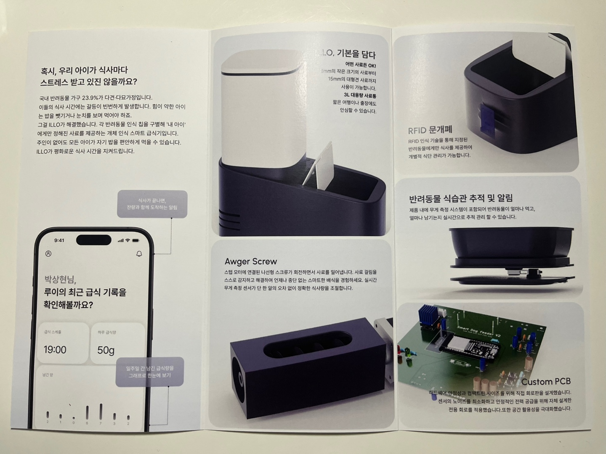

# 제품 디자인

## 급식 구조

사료는 스테퍼 모터에 연결한 Auger Screw로 밀어 냅니다. 회전량을 조절할 수 있고 반대로 돌릴 수도 있어, 양을 맞추거나 사료가 걸렸을 때 다시 풀어 보는 데 썼습니다. 사료 알갱이마다 다르게 걸릴 수 있어 스크루 간격과 배출구 모양은 계속 조정할 부분입니다.

## 외형

반려동물이 가까이 오거나 기대도 부담스럽지 않게 보이도록, 상단은 단단한 직선보다 둥근 모서리를 사용했습니다. 흰색 바탕에 짙은 남색을 아래쪽 포인트로 넣어 무게감은 잡되 너무 기계적으로 보이지 않게 했습니다.

## 모델링

