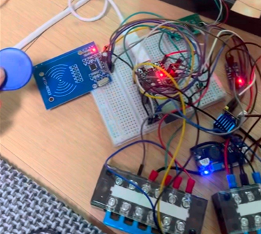
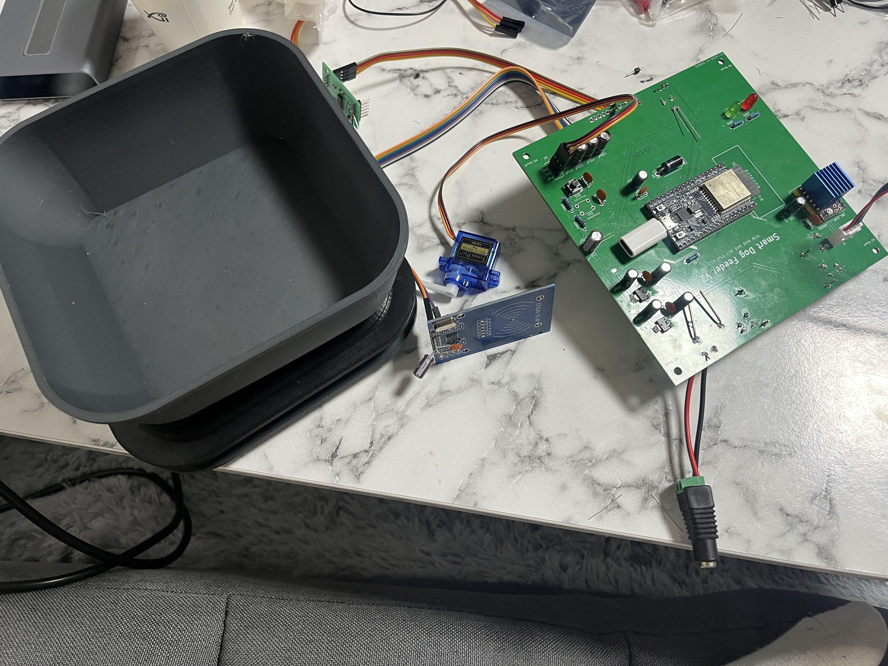
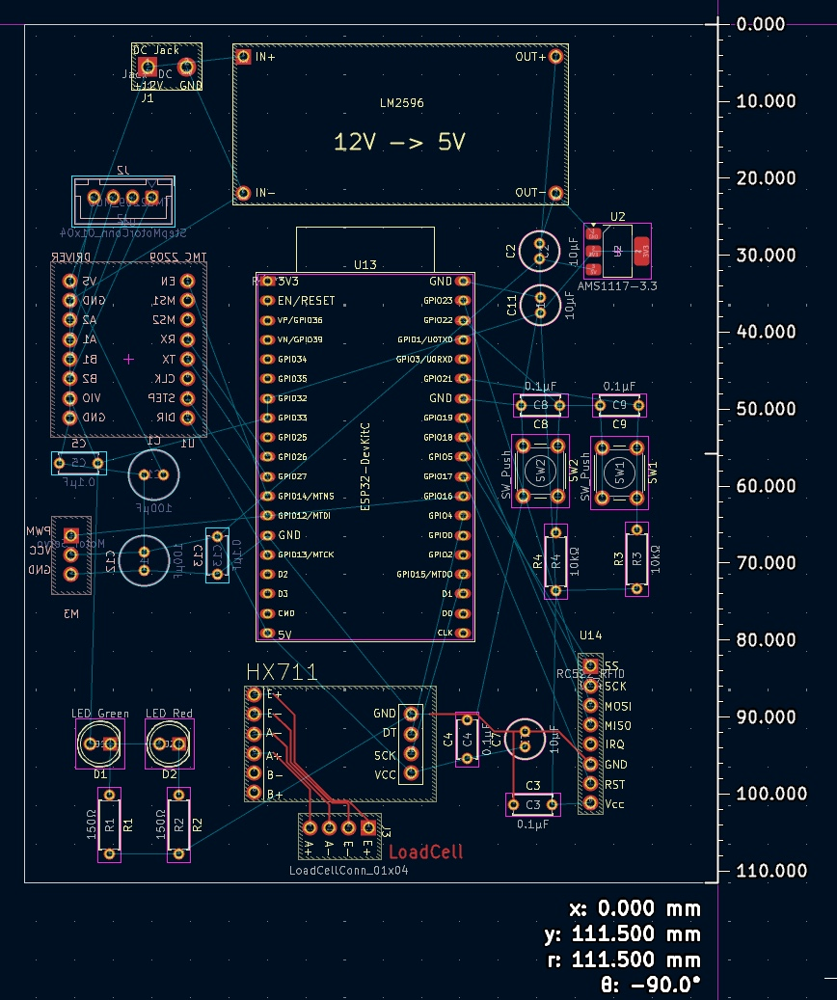

# 하드웨어

## 주요 부품

| 영역 | 구성 |
| --- | --- |
| Main controller | ESP32 DevKit V4 |
| 개체 식별 | RC522 RFID Module, RFID Tag |
| 급식 공간 제어 | SG90 Servo Motor |
| 사료 배출 | NEMA 17HS4401S, TMC2209, Auger Screw |
| 무게 측정 | Load Cell, HX711 Amplifier Module |
| 사료 보관 | 약 4.5 L 용기 |

Load Cell은 배식 중 목표 양을 확인하고, 식사 뒤 그릇에 남은 양을 잽니다. HX711은 그 작은 변화를 읽기 쉽게 바꿔 주는 모듈이라, 사용 전에 영점과 보정값을 맞춰야 합니다.

## 전원 구성

```text
12 V / 5 A Adapter
├── 12 V Motor Rail → Stepper Motor Driver
└── 5 V Buck Converter → Servo Motor
                       └── 3.3 V Regulator → RC522, HX711, Sensor Rail
```

모터 전원과 센서 전원은 갈라 두고 GND는 공통으로 연결했습니다. Load Cell과 RFID가 노이즈 영향을 많이 받아서, 커패시터를 넣고 모터 전류가 흐르는 배선과 센서 신호선도 떨어뜨려 배치했습니다.

## 시제품과 PCB

처음에는 브레드보드에서 RFID, 서보, 스테퍼, Load Cell, Wi-Fi·MQTT를 하나씩 확인했습니다. 배선이 복잡해진 뒤에는 연결을 정리하고 안정성을 높이기 위해 PCB를 설계했습니다.






